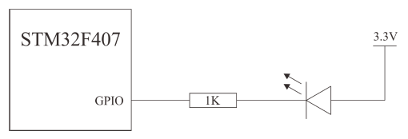

# iCore3 Dual-Core Control Board Laboratory Manual

## Overview
This manual provides detailed instructions for conducting an experiment with the iCore3 Dual-Core Control Board. The focus is on GPIO output to control a tri-color LED, offering a practical understanding of STM32 GPIO structure and characteristics.

## Features
- Introduction to STM32 GPIO and tri-color LEDs.
- Configuration guidelines for GPIO properties in STM32 firmware.
- Usage instructions for Keil MDK integrated development environment.