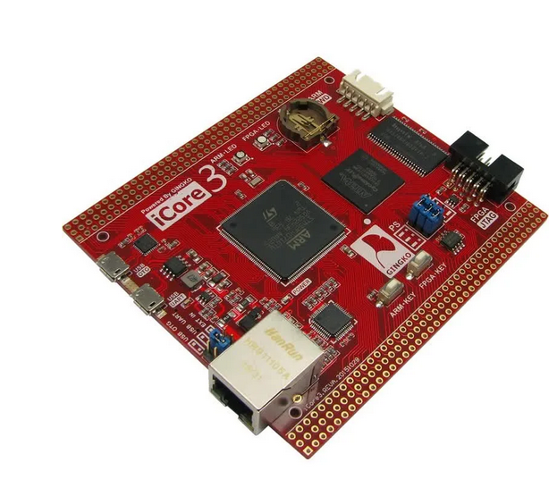
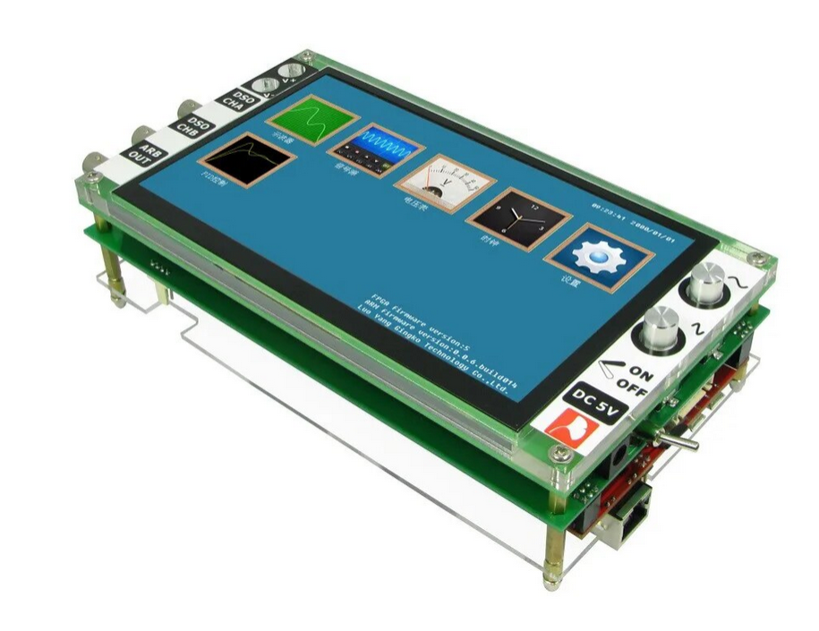

# Example for :
## iCore3 core board

Tabelle 1.ARM experiment routine.

## Catalog of all c /c++ experiment routine

In the following table, 

| Subdirectory | Topic |
|:-------------- |-----------------------------------------|
| [iCore3_leds](ARM-experiment-routine/Readme_Files/iCore3_leds.md) | Introduction to STM32 GPIO and tri-color LEDs.|
| [iCore3_buttons](ARM-experiment-routine/Readme_Files/iCore3_buttons.md) | Introduction to STM32 GPIO Buttons.|

---

## iCore3_ADP: Oscilloscope signal-generator voltage-meter STM32 CPLD ARM FPGA development board

